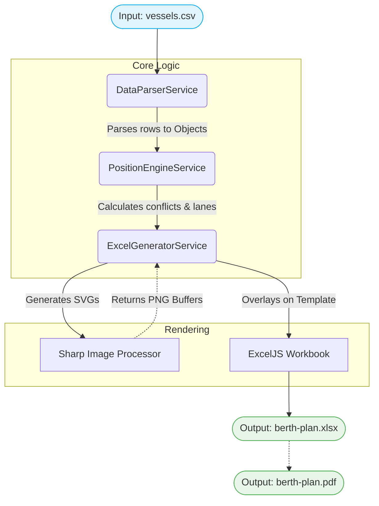

# RSGT Berth Schedule POC Report

This document outlines the technical details of the RSGT Berth Schedule POC, specifically focusing on how vessel dimensions and the timeline are calculated, the core architecture, and the primary libraries used.

---

## 1. Calculating Vessel Length and Berth Occupancy Duration

The application translates real-world vessel metrics (meters and time) into Excel cell dimensions (columns and rows) using a two-step process involving the **Position Engine** and the **Excel Generator**.

### Vessel Length (Width in Columns)
1. **Physical Length (Meters):** The length is determined in `PositionEngineService` by calculating the absolute difference between the `foreMeter` and `aftMeter` values from the CSV.
   * `occupiedLength = Math.max(foreMeter, aftMeter) - Math.min(foreMeter, aftMeter)`
2. **Column Mapping:** In `ExcelGeneratorService`, the berth zone (e.g., R1, R2, R3) is assigned a fixed static column range.
3. **Sub-lane Calculation:** If multiple vessels overlap in the same time frame within the same berth zone, the engine divides the zone into sub-lanes (`berthMaxLanes`).
4. **Excel Scaling:** The physical vessel width in Excel columns is scaled by a factor of 25 meters per column:
   * `physicalVesselWidthCols = occupiedLength / 25.0`
5. **Centering:** The vessel graphic is visually centered within its assigned sub-lane, creating precise floating boundaries (`excelColStart` to `excelColEnd`).

### Vessel Height (Duration in Rows)
1. **Occupancy Time:** The `PositionEngineService` calculates the occupancy span using the best available data.
   * **Start:** Prioritizes ATB → ETB → ATA → ETA.
   * **End:** Prioritizes ATD → ETD.
2. **Row Mapping:** The Excel timeline is divided into **120-minute (2-hour) intervals**, where each interval represents exactly 1 row (`rowsPerInterval = 1`).
3. **Excel Scaling:** The fractional row for any given time is calculated relative to the schedule's baseline start date:
   * `intervalsDiff = (time - scheduleStartDate) / 120 minutes`
   * `excelRow = timelineStartRow + intervalsDiff`
4. The difference between `excelRowStart` and `excelRowEnd` defines the exact height of the vessel shape overlaid on the Excel sheet.

---

## 2. Building the Timeline

The visual timeline (the vertical Y-axis on the spreadsheet) dynamically builds itself to fit the incoming vessel data:

1. **Global Time Range:** The generator scans all vessels to find the absolute minimum start time and maximum end time across the dataset.
2. **Time Snapping:** The `scheduleStartDate` is snapped backwards to align perfectly with an even 2-hour block (e.g., 00:00, 02:00, 04:00). The `scheduleEndDate` is snapped forward.
3. **Row Generation:** The system iterates through the time range in 2-hour increments, writing the time strings (e.g., `0001-0200`, `0201-0400`) into column 11.
4. **Day Grouping:** As the generator iterates, it keeps track of the calendar day. Once a day ends (at `2201-2400`), it draws a thick border line across the grid and merges the Date (Col 12) and Day Name (Col 13) vertically across all intervals belonging to that day.

---

## 3. Core Packages and Dependencies

The backend is built with Node.js and relies on several specialized libraries:

* **@nestjs/core & @nestjs/common:** The fundamental framework providing dependency injection, modularity, and the underlying CLI structure.
* **exceljs (v4.4.0):** The primary engine used to read the empty Excel template, manipulate rows/cells, paint borders/colors, and embed images using floating absolute coordinates.
* **sharp (v0.35.4):** A high-performance image processing library. It dynamically generates the custom SVG shapes, rounded rectangles, text labels, and ship graphics on-the-fly and buffers them into PNGs for `exceljs` to inject.
* **csv-parser & csv-parse:** High-speed streaming parsers used to convert the raw `vessels.csv` input into typed JavaScript objects.

---

## 4. Architecture Diagram

The system operates as a data pipeline that parses, positions, renders, and exports the berth schedule.



---

## 5. Commands to Generate Reports

To generate the actual Berth Plan output reports (Excel and PDF formats) based on your input CSV data, use the built-in npm scripts provided in this project. 

Run these commands in your terminal from the `backend` directory:

### Generate PDF Report Only
```bash
npm run generate:berth-plan:pdf
```

### Generate Excel (XLSX) Report Only
```bash
npm run generate:berth-plan:xlsx
```

### Generate Both Formats
```bash
npm run generate:berth-plan
```
